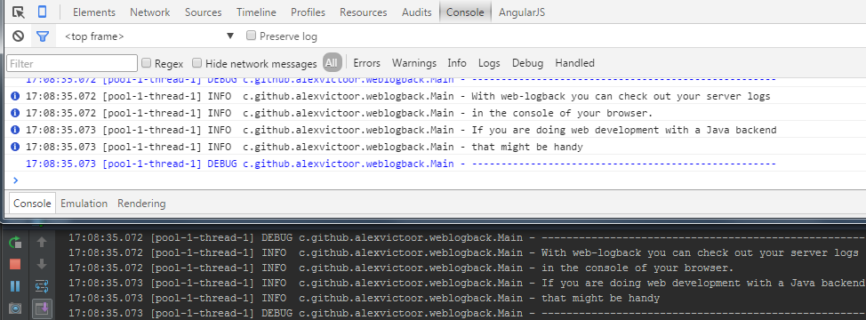

[](https://travis-ci.org/alexvictoor/web-logback)

web-logback
===========



Logback appender leveraging "HTML5 Server Sent Event" (SSE) to push logs on browser consoles. 
It is based on worderful Netty framework to implement a lightweight HTTP SSE server.

Usage
------

Activation requires 3 steps:
- configuration of your build to add a dependency to this project 
- configuration of the appender in the logback.xml configuration file
- inclusion of a javascript snippet in your HTML code to open a SSE connection

If you use maven, below the xml fragment you should add in the dependencies section of your pom file:
```xml
<dependency>
  <groupId>com.github.alexvictoor</groupId>
  <artifactId>web-logback</artifactId>
  <version>0.2</version>
</dependency>
```

Below an XML fragment example that shows how to configure logback on the server side
```xml
<configuration>
...
  <appender name="WEBOUT" class="com.github.alexvictoor.weblogback.BrowserConsoleAppender">
    <encoder>
      <pattern>%d{HH:mm:ss.SSS} [%thread] %-5level %logger{36} - %msg%n</pattern> <!-- Use whatever pattern you want -->
    </encoder>
    <port>8765</port> <!-- Optional, this is the port on which the HTTP SSE server will listen. Default port is 8765 -->
    <active>true</active> <!-- Optional, if false the appender is disabled. Default value is true -->
    <buffer>1</buffer> <!-- Optional, the size of a replay buffer for late joiners that will receive already emmited messages -->
  </appender>
...
</configuration>
```

In the browser side, the easiest way to get the logs is to include in your HTML document logback.js. This script is delivered by the embedded HTTP SSE server at URL path "/logback.js".  
During developpement, if you are running the appender with default setting you can simply add the following declaration in your HTML code:

    <script type="text/javascript" src="http://localhost:8765/logback.js"></script>
  
It gets even simpler when using a bookmarklet. To do so use your browser to display the "homepage" of the embedded HTTP SSE server (at URL http:// HOST : PORT where HOST & PORT are the parameters you have used in the log4net configuration). The main purpose of this "homepage" is to test your web-logback configuration but it also brings a ready to use bookmarklet (named "Get Logs!"). This bookmarklet looks like code fragment below:

    (function () { 
        var jsCode = document.createElement('script'); 
        jsCode.setAttribute('src', 'http://HOST:PORT/logback.js'); 
        document.body.appendChild(jsCode); 
    }());

Why SSE?
--------
[Server Sent Events](https://en.wikipedia.org/wiki/Server-sent_events) while being quite simple to implement, allows to stream data form a server to a browser leveraging on the HTTP protocol, just the HTTP protocol. Resources required on the server side are also very low. Simply put, to stream text log it makes no sens to use WebSocket which is much more complex.   
All newest browsers implement SSE, except IE... (no troll intended). Chrome even implements a nice reconnection strategy. Hence when you are using a Chrome console as a log viewer, log streams will survive to a restart of a server side process, reconnection are handled automatically by the browser.

Multiple server-side process?
-----------------------------
If you want to watch logs coming from several process, you just need one single browser console!  
Several bookmarlets can be executed on same browser location. To distinguisg logs coming from one service to logs coming from another one, you can use different log4net pattern, use a log prefix, or use custom styles (see next section). 


Custom colors and styles?
-------------------------
Once you are connected to several log streams, you will might want to get different visual appearance for those streams.  
By default all streams use default browser log styles. Styles can be customized by adding special attributed to logback.js script tag:

    <script 
        src="http://HOST:PORT/logback.js" 
        style="font-size: 18px; background: cyan" >
    </script>

Styles attrbutes can also be specific to a logging category:

    <script 
        src="http://HOST:PORT/logback.js" 
        style="color: black;" 
        style-error="color: red; font-size: 18px;" >
    </script>

With above example, all logs are written in black on white, size 12px, except error logs written in red, size 18px.  
Below a bookmarklet code that gives similar results:

    (function () { 
        var jsCode = document.createElement('script'); 
        jsCode.setAttribute('src', 'http://HOST:PORT/logback.js'); 
        jsCode.setAttribute('style' 'color: black;');
        jsCode.setAttribute('style-error' 'color: red; font-size: 18px;');
        document.body.appendChild(jsCode); 
    }());

Custom styles can be specify for debug (style-debug), info (style-info) and warn (style-warn) logs as well.


Disclaimer
---------
1. For obvious security concerns, **do not activate it in production!**  
2. Do not try to use this appender to log Netty activity... this might generate an infinite loop
3. This is a first basic not opimized implementation, no batching of log messages, etc
