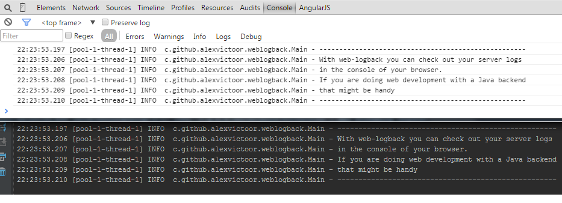

[](https://travis-ci.org/alexvictoor/web-logback)

web-logback
===========



Logback appender leveraging "HTML5 Server Sent Event" (SSE) to push logs on browser consoles. 
It is based on worderful Netty framework to implement a lightweight HTTP SSE server.

Usage
------

Activation requires 3 steps:
- configuration of your build to add a dependency to this project 
- configuration of the appender in the logback.xml configuration file
- inclusion of a javascript snippet in your HTML code to open a SSE connection

If you use maven, below the xml fragment you should add in the dependencies section of your pom file:
```xml
<dependency>
  <groupId>com.github.alexvictoor</groupId>
  <artifactId>web-logback</artifactId>
  <version>0.1</version>
</dependency>
```

Below an XML fragment example that shows how to configure logback on the server side
```xml
<configuration>
...
  <appender name="WEBOUT" class="com.github.alexvictoor.weblogback.BrowserConsoleAppender">
    <encoder>
      <pattern>%d{HH:mm:ss.SSS} [%thread] %-5level %logger{36} - %msg%n</pattern> <!-- Use whatever pattern you want -->
    </encoder>
    <port>8765</port> <!-- Optionnal, this is the port on which the HTTP SSE server will listen. Default port is 8765 -->
    <active>true</active> <!-- Optionnal, if false the appender is disabled. Default value is true -->
  </appender>
...
</configuration>
```

In the browser side, the easiest way to get rour logs is to include in tour HTML document script "logback.js" delivered by the embedded HTTP SSE server.  
During developpement, if you are running the appender with default setting you can simply add the following declaration in your HTML code:

    <script type="text/javascript" src="http://localhost:8765/logback.js"></script>
  

Discaimer
---------
1. For obvious security concerns, **do not activate it in production!**  
2. Do not try to use this appender to log Netty activity... this might generate an infinite loop
3. This is a first basic not opimized implementation, no batching of log messages, no buffering, etc
